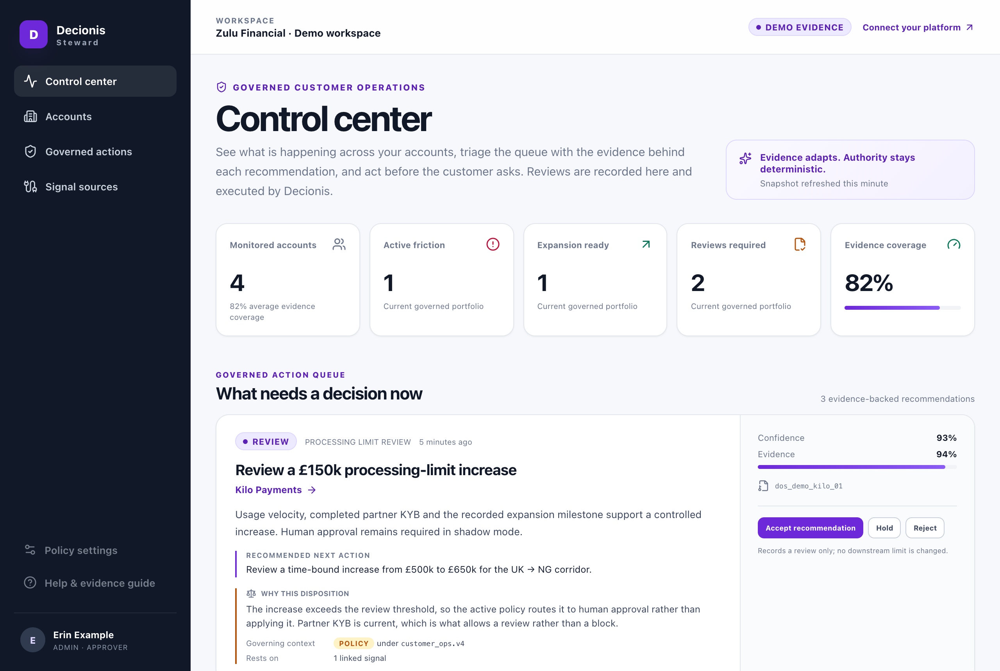
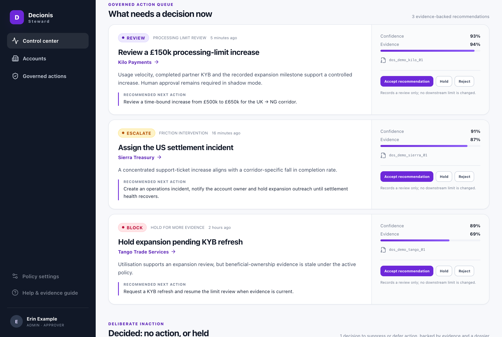
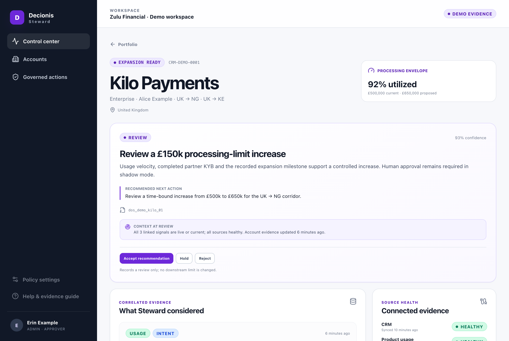

<p align="center">
  
</p>

# Decionis Steward

[](https://github.com/decionis/steward/actions/workflows/verify.yml)
[](https://github.com/decionis/steward/actions/workflows/audit.yml)
[](https://scorecard.dev/viewer/?uri=github.com/decionis/steward)
[](./LICENSE)

**Signal capture and decisioning for enterprise customer operations.**

**[Try the live demo →](https://decionis-steward.vercel.app)** — the whole operator workflow on
deterministic fixtures. No account, no credentials, nothing to install.

Steward is the operational control center for Adaptive Customer Decision Intelligence. It gives customer
operations, risk, and revenue teams a single reviewable surface over their account portfolio: it
correlates account evidence, surfaces friction and expansion opportunities, and forwards every
operator review to the Decionis execution control plane — where the authoritative decision is made,
recorded, and executed.

The problem it solves: in regulated fintech, the people closest to the customer can see that an
account is ready for a higher processing limit or is about to churn, but they cannot act on it
without an auditable, policy-bound path. Steward is that path. Every action an operator takes here
becomes a reviewed, attributable event upstream — never an ad-hoc change made in a spreadsheet.



## What Steward is not

This boundary is the most important thing to understand before contributing.

Steward does **not** own policy evaluation, connector secrets, execution grants, or Decision Dossiers.
Those remain authoritative in the Decionis platform. Steward is a presentation and orchestration layer:

| Steward owns                           | Decionis platform owns                                |
| -------------------------------------- | ----------------------------------------------------- |
| The operator UI and review workflow    | Policy evaluation and the `customer_ops` policy pack  |
| Server-side orchestration (the BFF)    | Connector credentials and identity resolution         |
| Typed, runtime-validated API contracts | Execution grants, Decision Dossiers, the audit ledger |
| Formatting and presentation policy     | The authoritative record of every review              |

An operator can accept a review in Steward. That acceptance cannot, by itself, change a processing limit
or a policy. Steward forwards the review; Decionis decides, executes, and returns the resulting state and
a dossier reference.

[OpenCore.md](./OpenCore.md) states the same boundary as a business model: what is free forever,
what Decionis operates, and the one point where commerce enters the flow.
[docs/Distribution.md](docs/Distribution.md) is the plan for shipping Steward as a container and
being found by the agents that evaluate it.

```text
Browser
  -> Steward Next.js server / BFF          <- this repository
    -> Decionis /v1/cdi APIs
      -> SignalFed, connectors, identity resolution
      -> customer_ops policy pack
      -> execution grants, dossiers, ledger
```

## Install

One application, four ways to run it. The image, the tarball and the source are built from the
same commit, and nothing about the trust boundary differs between them.

| Where           | How                                                                                                                                                  | Page                                       |
| --------------- | ---------------------------------------------------------------------------------------------------------------------------------------------------- | ------------------------------------------ |
| Docker          | `docker run -p 3000:3000 ghcr.io/decionis/steward:<version>`; the same digest as `docker.io/decionis/steward`; two architectures, non-root, attested | [docs/Docker.md](docs/Docker.md)           |
| Release tarball | `decionis-steward-<version>.tar.gz` from the [releases](https://github.com/decionis/steward/releases), with its SBOM and provenance                  | [Deployment](#deployment)                  |
| From source     | `pnpm install && pnpm dev`, demo mode, no credentials                                                                                                | [Quickstart](#quickstart)                  |
| Hosted demo     | <https://decionis-steward.vercel.app>, demo mode, nothing to install                                                                                 | [What you get](#what-you-get-in-demo-mode) |

Every path starts in demo mode and ends at the same place: connecting a Decionis workspace, which
[OpenCore.md](./OpenCore.md) explains costs nothing until a review is meant to execute. An agent
evaluating a deployment reads `/llms.txt` on any of them.

## Quickstart

Requires **Node >= 20** and **pnpm 9**. No Decionis credentials are needed — the app boots against
deterministic demo fixtures.

```bash
cp .env.example .env.local
pnpm install
pnpm dev
```

Open <http://localhost:3000>.

### What you get in demo mode

`STEWARD_DATA_MODE=demo` (the default outside production) serves every screen from
`infra/demo/DemoStewardData.ts` via `DemoStewardRepository`. You are signed in as a fixture operator with
`ADMIN` and `APPROVER` roles in the `demo-fintech` organization, so the full review flow is
exercisable end to end:

- **Portfolio dashboard** (`/`) — account health, evidence coverage, the summary counters that
  drive triage, and the decisions that reached an outcome under "Recently resolved".
- **Opportunity queue** — friction interventions, KYC/KYB escalations, processing-limit reviews, and
  expansion outreach, each with its rationale, confidence, linked evidence, and the platform's "Why
  this disposition". Deliberate inaction is grouped beneath the queue rather than hidden.
- **Account detail** (`/accounts/[id]`) — evidence signals with their context class and a coverage
  strip, connection health, applicable policy, the state of the context at the moment of review,
  and the decision timeline.



Every review control is captioned _"Records a review only; no downstream limit is changed."_ That is
the trust boundary stated in the interface, not only in the documentation. It is also the free tier:
the top bar's "Connect your platform" link leads to the Decionis sign-in handoff, and
[OpenCore.md](./OpenCore.md) says what is paid from there.



Reviews submitted in demo mode return a deterministic result. Nothing is persisted and no downstream
action is executed.

Screenshots are generated from a running instance with `pnpm screenshots`, so they can be refreshed
rather than left to drift out of date.

## Configuration

All configuration is parsed and validated once, at startup, by `StewardRuntimeConfig.fromEnvironment()`.
Invalid or missing required values fail fast rather than degrading at request time.

| Variable                           | Required         | Default                           | Purpose                                                         |
| ---------------------------------- | ---------------- | --------------------------------- | --------------------------------------------------------------- |
| `STEWARD_DATA_MODE`                | no               | `live` in production, else `demo` | Selects `DemoStewardRepository` or `DecionisStewardRepository`. |
| `DECIONIS_API_BASE_URL`            | **in live mode** | —                                 | Decionis API origin. Startup throws in live mode if unset.      |
| `DECIONIS_STEWARD_SERVICE_TOKEN`   | no               | —                                 | Server-to-server fallback credential. Prefer a user session.    |
| `STEWARD_ACCESS_TOKEN_COOKIE`      | no               | `decionis_access_token`           | Cookie carrying the Decionis access token.                      |
| `STEWARD_ORG_ID_COOKIE`            | no               | `decionis_org_id`                 | Cookie carrying the organization scope.                         |
| `NEXT_PUBLIC_DECIONIS_SIGN_IN_URL` | no               | `https://decionis.com/sign-in`    | External identity handoff target used by `/sign-in`.            |

Two further cookies are read opportunistically in live mode and are **not** required:
`decionis_display_name` (URL-encoded, for the app shell) and `decionis_roles` (a comma-separated
subset of `VIEWER,OPERATOR,APPROVER,ADMIN`; anything unrecognized is dropped, and an empty result
falls back to `VIEWER`).

No API credential is ever exposed to browser code. The upstream client is server-only, and its
request timeout is currently fixed at 8s in `StewardRuntimeConfig`.

## Live mode

```dotenv
STEWARD_DATA_MODE=live
DECIONIS_API_BASE_URL=https://api.decionis.com
```

In live mode `middleware.ts` requires a Decionis session on every path except `/api/health`,
`/sign-in`, and the discovery files `/llms.txt` and `/llms-full.txt`. Page requests without one are redirected to `/sign-in?returnTo=…`; API requests receive
`401 {"error":"UNAUTHORIZED"}`. BFF callers may instead present an `Authorization: Bearer` token with
an `X-Decionis-Org-Id` header.

A live API failure surfaces as an error. It **never** falls back to demo fixtures — silently showing
fabricated data to an operator making a regulated decision is treated as a defect, not a resilience
feature.

### Routes this app exposes

| Route                                    | Method | Notes                                       |
| ---------------------------------------- | ------ | ------------------------------------------- |
| `/api/steward/portfolio`                 | GET    | Portfolio snapshot for the session's org.   |
| `/api/steward/accounts/[id]`             | GET    | `404` when the account is unknown.          |
| `/api/steward/opportunities`             | GET    | Opportunity queue.                          |
| `/api/steward/opportunities/[id]/review` | POST   | Requires `APPROVER` or `ADMIN`, else `403`. |
| `/api/health`                            | GET    | Unauthenticated liveness probe.             |
| `/llms.txt`, `/llms-full.txt`            | GET    | Machine discovery; no session, indexable.   |

### Upstream endpoints it expects

- `GET /v1/cdi/portfolio`
- `GET /v1/cdi/accounts/:accountId`
- `GET /v1/cdi/opportunities`
- `POST /v1/cdi/opportunities/:opportunityId/reviews`

Every upstream response is parsed through a Zod contract in `domain/` before it is allowed into the
application layer, so schema drift upstream fails loudly at the boundary instead of rendering as a
subtly wrong number on a dashboard.

## Deployment

The published image is the quickest path. It is built for `linux/amd64` and `linux/arm64`, runs
unprivileged, defaults to demo mode, and carries a signed provenance attestation:

```bash
docker run -p 3000:3000 ghcr.io/decionis/steward:<version>   # demo mode, no credentials
gh attestation verify oci://ghcr.io/decionis/steward:<version> --repo decionis/steward
```

The same digest is on Docker Hub as `decionis/steward`. [docs/Docker.md](docs/Docker.md) covers
tags, live mode, verification and what the image does and does not hold.

`next.config.ts` sets `output: "standalone"`, so the build emits a self-contained server. The
included [Dockerfile](./Dockerfile) packages it:

```bash
docker build -t decionis-steward .
docker run -p 3000:3000 decionis-steward          # demo mode, no credentials
```

```bash
docker run -p 3000:3000 \
  -e STEWARD_DATA_MODE=live \
  -e DECIONIS_API_BASE_URL=https://api.decionis.com \
  decionis-steward                                 # live mode
```

The image runs as a non-root user, disables Next telemetry, and declares a `HEALTHCHECK` against
`/api/health` — which is exempt from the session middleware precisely so probes work without a
Decionis session.

If you deploy without Docker, note that `.next/standalone` is **not** self-sufficient: `next build`
emits static assets separately, and `.next/static` must be copied alongside the server. The Dockerfile
and [release workflow](.github/workflows/release.yml) both do this.

Tagged releases ship a deployable tarball, a CycloneDX SBOM, and a signed SLSA provenance
attestation. Verify an artifact came from this repository before deploying it:

```bash
gh attestation verify decionis-steward-<version>.tar.gz --repo decionis/steward
```

## Architecture

Four layers, one direction of dependency: `app` → `application` → `domain`, with `infra` supplying
implementations through a composition root and `presentation` holding formatting policy only.

| Layer           | Responsibility                                                     |
| --------------- | ------------------------------------------------------------------ |
| `app/`          | Next.js routes, the BFF, and framework entrypoints.                |
| `application/`  | Use-case services and permission checks (`OpportunityService`, …). |
| `domain/`       | Typed, runtime-validated Steward contracts. No I/O.                |
| `infra/`        | Gateways, repositories, config, errors, demo data, composition.    |
| `presentation/` | Formatting and presentation policy.                                |

Swapping demo for live is a single decision in `StewardRepositoryFactory` behind the `StewardRepository`
interface — the application and UI layers cannot tell the difference. See
[Architecture.md](./Architecture.md) for the full boundary and directory map.

[docs/ContextEngineering.md](docs/ContextEngineering.md) maps the design onto the
context-engineering framework (sense, interpret, arbitrate, act) and records the plan for making each
of the platform's decisions more legible to the operator reviewing it.

## Development

```bash
pnpm dev              # Next.js dev server
pnpm test             # Vitest
pnpm test:watch       # Vitest in watch mode
pnpm lint             # ESLint
pnpm typecheck        # tsc --noEmit
pnpm format:fix       # Prettier write
pnpm verify           # format + lint + typecheck + test + build
pnpm licenses:check   # Fail on a dependency outside the approved license policy
pnpm licenses:list    # Production dependency licenses
pnpm screenshots      # Regenerate the README screenshots from a running instance
```

`pnpm verify` is the gate — run it before opening a pull request.

CI runs it on Node 20 and 22 (`.github/workflows/verify.yml`), and separately runs the supply-chain
gate (`.github/workflows/audit.yml`) — a production-tree audit at any severity, a whole-tree audit at
high and critical, and the license policy check — on every pull request and again weekly, so an
advisory published against an unchanged tree still surfaces.

### Dependency policy

Production dependencies must carry a license in the approved set enforced by
[CheckLicensePolicy.mjs](scripts/CheckLicensePolicy.mjs). Adding a dependency under any other license
requires an explicit, package-scoped exception in that file and a recorded rationale in
[ThirdPartyLicenses.md](./ThirdPartyLicenses.md).

`package.json` carries a `pnpm.overrides` block pinning `postcss`, `nanoid`, and `sharp` above known
vulnerable ranges. These are forward pins to patched releases, not version freezes — remove each once
the upstream `next` range resolves past it on its own.

### Conventions

- **Feature and domain files use PascalCase** (`AccountService.ts`, `CustomerOpportunity.ts`).
  Framework-required files keep Next.js naming (`page.tsx`, `layout.tsx`, `route.ts`,
  `middleware.ts`), as do directory segments.
- **Classes and interfaces over loose utility functions.** Each module gets one reason to change.
- **camelCase** for variables, properties, and methods.
- Full rules in [coding.rule.md](./coding.rule.md).

### Non-negotiable rules

1. Evidence may adapt; policy authority stays deterministic.
2. Demo mode is explicit. A live API failure never falls back to fixtures.
3. Review actions are role-gated in `application/` and forwarded to Decionis — the UI is not the
   enforcement point.
4. No credential, token, or connector secret reaches client-side code.

## Security

This repository holds no secrets and no policy logic, which is what makes it safe to develop against
in the open.

The trust boundary is enforced in four files, and each is covered by tests you can run:

| Enforcement                                             | Code                                                                     | Tests                            |
| ------------------------------------------------------- | ------------------------------------------------------------------------ | -------------------------------- |
| Session gating, 401-vs-redirect, health-probe exemption | [middleware.ts](middleware.ts)                                           | `middleware.test.ts`             |
| Role parsing and the `VIEWER` privilege floor           | [StewardSessionResolver.ts](infra/auth/StewardSessionResolver.ts)        | `StewardSessionResolver.test.ts` |
| Credential handling and boundary schema validation      | [JsonHttpClient.ts](infra/api/JsonHttpClient.ts)                         | `JsonHttpClient.test.ts`         |
| Role-gated review forwarding                            | [OpportunityService.ts](application/opportunities/OpportunityService.ts) | `OpportunityService.test.ts`     |

Four properties the tests assert directly: the access token never appears in a request URL, only in
the `Authorization` header; no client component ever receives the session, so the token is never
serialized into a page payload; an unrecognized or wrong-case role claim resolves to `VIEWER` rather
than to an empty role set; and an unhandled error maps to a generic 500 that leaks no internal detail.

**Evaluating Steward as a vendor?** [EvidencePack.md](./EvidencePack.md) maps the usual security-review
questions to the artifact that answers each one, and states the gaps as plainly as the strengths.

[ThreatModel.md](./ThreatModel.md) sets out the assets, trust boundaries, seven named threats with the
code and test backing each mitigation, the security headers this app sets — and, deliberately, the
gaps we have accepted rather than fixed.

**Reporting a vulnerability:** do not open a public issue. See [SECURITY.md](./SECURITY.md) for the
private disclosure process, scope, and response targets.

## Contributing

Contributions are welcome. Start with **[CONTRIBUTING.md](./CONTRIBUTING.md)** for setup, the review
gate, conventions, and DCO sign-off.

Run `pnpm verify` before opening a pull request — a green local run means a green CI run.

Read the trust boundary above before proposing anything that moves decision authority into this
repository. Evaluating policy locally, persisting customer data in this tier, or falling back to
fixtures when a live call fails are the changes this project will not accept, and CONTRIBUTING.md
says so up front so you find out from a document rather than from a closed pull request.

Participation is governed by our [Code of Conduct](./CODE_OF_CONDUCT.md). Contributions are accepted
under Apache-2.0 per section 5 of the [LICENSE](./LICENSE); there is no CLA.

## License

Licensed under the **Apache License, Version 2.0** — see [LICENSE](./LICENSE) and [NOTICE](./NOTICE).
Copyright 2026 Decionis, Inc.

Apache-2.0 is the default license across Decionis projects: permissive, with an express patent grant.

Third-party components and their licenses are inventoried in
[ThirdPartyLicenses.md](./ThirdPartyLicenses.md). No dependency imposes a reciprocal obligation on
this codebase.

`package.json` is marked `"private": true`. That prevents accidental publication to npm — this is a
deployable application, not a library — and does not restrict use of the source under Apache-2.0.

## Project status

> **Formerly "Decionis CDI".** Renamed to Steward in August 2026, before external adoption. The
> GitHub URL redirects, but releases `v0.1.0`–`v0.1.2` keep `decionis-cdi-*` artifact names — those
> names are bound into signed provenance attestations and are left as the historical record.

Public and Apache-2.0 licensed. Latest release **v0.3.0**; pre-1.0 and under active development, so
contracts in `domain/` may change without a deprecation period before `1.0.0` — pin exactly if you
integrate against those types. [CHANGELOG.md](./CHANGELOG.md) records what has shipped.

Evaluating Steward as a vendor? [EvidencePack.md](./EvidencePack.md) maps the usual security-review
questions to the artifact that answers each, and states the gaps as plainly as the strengths.
[OpenSource.md](./OpenSource.md) is the record of how this repository was prepared for public
release, including what was found wrong along the way.
