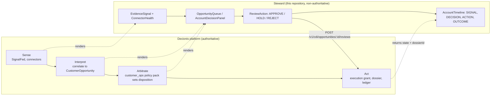

# Context Engineering and Steward

**Status: implemented.** All seven workstreams merged on 24 September 2026, each from its own
branch off `master`: W0 #63, W1 #69, W2 #70, W3 #68, W4 #64, W5 #71, W6 #66, with the audit fix
as #65. Stage 4, live activation, waits on the platform shipping the versioned contract change;
nothing in Steward changes when it does, the optional fields simply start arriving. The map below
is a reading of the tree at approval time.

Two sources, read together:

- **CMSWire.** Behnam Behzadyfar, _"What Is Context Engineering — and Why Does It Beat
  Personalization?"_, 21 September 2026
  ([link](https://www.cmswire.com/customer-experience/what-is-context-engineering-and-why-does-it-beat-personalization/)).
  Supplies the framework: six signal classes, an arbitration layer, intentional inaction, the
  Context-to-Value Loop.
- **CX Today.** Rob Scott, _"AI Is Moving Faster Than Customer Operations. That Is the Real CX
  Challenge."_, 17 September 2026
  ([link](https://www.cxtoday.com/ai-automation-in-cx/ai-is-moving-faster-than-customer-operations-that-is-the-real-cx-challenge/)).
  Supplies the test: can the person acting see where each data point came from, whether it is fresh,
  complete or disputed, and which information led to the recommendation?

## The one-paragraph answer

Steward already _is_ a context-engineering architecture, at the operator tier. CMSWire's
sense-interpret-arbitrate-act loop is the account timeline's `SIGNAL → DECISION → ACTION → OUTCOME`.
Its "arbitration layer" is the `customer_ops` policy pack, which Steward is forbidden from
reimplementing. Its "ephemeral telemetry" is this tier's no-database, `no-store`, fetch-per-request
design. Its "intentional inaction" is `HOLD_FOR_MORE_EVIDENCE` and `NO_ACTION`. CX Today's list of
what someone must still determine, "which system is authoritative, what data is current, which
policy applies, what action is permitted, and who becomes accountable when the answer is wrong", is
the [README](../README.md)'s ownership table read aloud. Neither article tells Steward to do anything
it is not already doing; together they give the design a vocabulary and a checklist. Held against that
checklist, Steward's gaps are all **legibility** gaps, not authority gaps: the arbitration outcome is
prose, inaction is invisible, operational state is buried in a recommendation string, evidence is
classified by where it came from rather than by what kind of context it is, freshness is never
summarised at the moment of decision, and no decision is ever shown reaching an outcome. Seven
workstreams close them. Five are presentation-only. Two add optional fields to domain contracts and
need a matching change on the Decionis platform.

## The CMSWire article, reviewed

### What it argues

- **Personalization asks "who is this customer?"; context asks "what is happening to this customer
  right now?"** Historical value and momentary state are often in direct opposition, and a stack that
  acts on the former while ignoring the latter is "brand-destructive". The worked example is a
  high-value investor whose fund transfer fails twice and who is then served a promotional banner.
- **Context Engineering** is "the architectural and operational discipline of dynamically capturing,
  assembling and weighting customer, behavioral, environmental and operational signals at the precise
  runtime of decisioning". Its mandate is whether an action "should execute at all", not how it is
  worded.
- The root problem is **contextual discontinuity**: records, journey state, live operational health,
  and campaign logic live in silos with "divergent refresh cycles and fragmented definitions of
  state".
- **Six real-time signal classes** make up context: Environmental, Journey & Channel, Micro Intent,
  Observed Friction, Operational & Infrastructure State, and Business & Policy Boundaries. The goal
  is "the minimum viable payload of high-fidelity signals", not exhaustive collection.
- **Ephemeral context is privacy-first.** Signals are assembled at runtime, used once, and decay,
  instead of accumulating in a tracking database.
- **Context Arbitration** is "an algorithmic governance layer that determines signal authority when
  competing commercial and operational rules collide". Propensity must not beat an outage; a
  campaign target must not beat a regulatory boundary.
- **Contextual Value Decisioning** picks the action from live state, not from predicted value alone.
  The action set is sell, assist, recover, escalate, or **deliberately do nothing**, and suppression
  "protects vastly more economic value than extracting an incremental click".
- For agentic AI the article separates **prompt engineering** (how the model is instructed),
  **context engineering** (the operational reality it receives), and **context governance** (what
  the agent is authorized to execute).
- It does not replace the CDP, CRM, or journey tooling; it is "an event-driven intelligence layer
  that binds them into a unified operational loop", the **Context-to-Value Loop**.

### What it gets right for Steward

The article's whole argument is that decision authority must come from live operational and policy
state rather than from a static profile. That is the first non-negotiable in the
[README](../README.md): "Evidence may adapt; policy authority stays deterministic." The article's
worked example, a service failure that should suppress a commercial action, is the Sierra Treasury
fixture almost line for line: a support spike correlated with a settlement completion drop, and a
recommendation that ends "hold expansion outreach until settlement health recovers".

### Where to read it with care

- **It is an opinion piece.** No data, no case study, no measured outcome. Treat the framework as a
  useful lens, not as evidence that any particular change will pay off.
- **The term collides.** In AI engineering, "context engineering" means curating what goes into a
  model's context window. The article borrows the phrase for martech. Steward has no model in it, so
  the collision is harmless here, but anyone searching the term will land on the other meaning.
- **"Decays immediately after execution" cannot apply to a regulated decision.** The decision record
  must persist somewhere, or there is no audit. Steward resolves this the right way already: context
  is ephemeral _in this tier_ and durable _in the platform's ledger and Decision Dossier_. The plan
  must not import the article's ephemerality into the authoritative record.
- **It is written for marketing.** "Customer", "offer", and "outbound interaction" need translating
  before the six classes mean anything for an operator console. The table below does that.
- **It never says who owns arbitration.** In Steward's world that is unambiguous, and the answer is
  "not Steward". Every gap below is closed by _rendering_ an arbitration the platform made, never by
  making one.

## The CX Today article, reviewed

### What it argues

- **Better models do not equal better operations.** Reporting from Dreamforce 2026, the piece
  accepts that models can now "reason through complex work" and generate interfaces on demand, then
  insists that none of it "resolves a customer's problem if the data is incomplete, the entitlement
  rules are unclear, the relevant workflow is disconnected, or nobody has decided when the AI should
  stop and involve a person".
- **Customers do not live inside a single system.** A service issue spans CRM, orders, billing,
  knowledge, contract, loyalty, delivery, contact centre, "and a policy that has changed since the
  last interaction". Retrieval from each is not the hard part. Someone "still needs to determine
  which system is authoritative, what data is current, which policy applies, what action is
  permitted, and who becomes accountable when the answer is wrong".
- **A helpful answer is not a resolution.** The missing-order example: a fluent reply is easy;
  resolution needs status, entitlement, exception, authorisation, a case update, a replacement, and a
  notification, each depending on data, rules, permissions, and "a route to a capable human".
- **Dynamic interfaces do not remove the need for judgment.** "Can the employee see where each data
  point came from? Can they tell whether it is fresh, complete, or disputed? Do they understand which
  information led the AI to recommend an action?" Then the line that matters most for this
  repository: "The danger is that a more elegant interface makes an uncertain decision look more
  certain than it is."
- **Start where the foundation is strongest and the problem is clearest**, prove improved resolution
  inside defined boundaries, then expand. Measure outcomes and trust, "not just whether fewer
  interactions reach a human".
- **Five questions for CX leaders**, reproduced and answered for Steward below.

### What it adds for Steward

CMSWire says what context is. CX Today says what an interface owes the person acting on it. Steward's
evidence panel already answers two of the three interface questions: every signal carries `source`,
`sourceRecordId`, `observedAt`, `freshness`, and `confidence`, and every opportunity carries
`evidenceIds`. The third, which information _led to_ the recommendation and which was overruled, is
the arbitration gap (G3). And the warning about elegance is aimed squarely at Steward's confidence
badge and coverage bar: a card can show `93% confidence` above evidence that is `AGING` from a
connector that is `DEGRADED`, and nothing on the card says so (G5).

The article's own advice on sequencing, prove resolution in a narrow well-founded journey before
widening, is also the argument for Steward's scope (`OpportunityKind` is six well-defined kinds, not
"anything about the customer") and for the sequencing of this plan (presentation-only first).

### Where to read it with care

- **It is Dreamforce coverage.** The frame is Salesforce and OpenAI; the examples are retail service.
  The transferable part is the operational-readiness argument, which holds for any decisioning
  system, agentic or not. Steward has no model, and nothing here proposes adding one.
- **No data either.** One quotation from a keynote, no measured outcomes.
- **"Disputed" has no producer in Steward's world.** The platform does not currently mark evidence as
  contested. Noted under "Out of scope"; not pursued.

### The five questions, answered for Steward

| CX Today asks                                                                       | Steward today                                                                                                                                        | Plan                                                                  |
| ----------------------------------------------------------------------------------- | ---------------------------------------------------------------------------------------------------------------------------------------------------- | --------------------------------------------------------------------- |
| Which customer problems are we actually trying to resolve?                          | Six `OpportunityKind`s: friction, KYC/KYB escalation, processing-limit review, expansion, hold, no action. Narrow on purpose.                        | None. This is the scope, and it is right.                             |
| Is the data behind those journeys reliable, current, permissioned, and explainable? | Zod contracts at the boundary; `freshness` and `SourceHealth` per item; org scope forwarded, never taken from the route; provenance on every signal. | W4 summarises "current" at the decision. W1, W2 finish "explainable". |
| What can an agent do independently, and where must a person remain accountable?     | `policyEnvelope.automaticChangesEnabled`, `maximumAutoIncreasePercent`, "Human approval required", the `APPROVER` gate.                              | None. Shown on every account page today.                              |
| Can a customer understand, challenge, and recover from an automated decision?       | Challenge: `REJECT`, `HOLD`. Understand: `rationale` prose. Recover: nothing shows what a decision led to.                                           | W2 (understand), W6 (recover: outcomes).                              |
| Are we improving resolution and trust, or accelerating a broken process?            | The queue counts what needs a decision. Nothing counts what a decision resolved.                                                                     | W6.                                                                   |

### Translation

| Article says                        | Steward means                                                               |
| ----------------------------------- | --------------------------------------------------------------------------- |
| The customer                        | The account (a business customer, e.g. `Kilo Payments`)                     |
| Martech stack, CDP, CRM             | Decionis platform: SignalFed, connectors, `customer_ops` policy pack        |
| Outbound interaction, offer         | A recommended operator action: limit increase, expansion outreach, incident |
| Suppression, intentional inaction   | `HOLD_FOR_MORE_EVIDENCE`, `NO_ACTION`, disposition `BLOCK`, review `HOLD`   |
| Customer lifetime value, propensity | `segment`, `healthScore`, `limitUtilization`, `EXPANSION_READY`             |
| The autonomous agent, the AI        | Today: the operator plus the policy pack. Steward has no model in it.       |
| Runtime of decisioning              | The moment an `APPROVER` clicks a review button in `ReviewAction`           |
| Resolution (CX Today)               | `OpportunityStatus.COMPLETED` and an `OUTCOME` timeline event               |

## The map

### The Context-to-Value Loop over the trust boundary



Every solid arrow inside the platform is something Steward must not do. Every dotted arrow is
something Steward does today. The plan adds nothing but dotted arrows.

### The six signal classes

| CMSWire class                      | Article examples                                        | Steward today                                                                                                                                                         | Fit          | Gap                                                                              |
| ---------------------------------- | ------------------------------------------------------- | --------------------------------------------------------------------------------------------------------------------------------------------------------------------- | ------------ | -------------------------------------------------------------------------------- |
| Environmental                      | Network latency, device state, app resource constraints | Nothing, deliberately. This is end-customer device telemetry; the platform does not observe it and Steward will not collect it.                                       | Out of scope | None to close. See "Out of scope".                                               |
| Journey & Channel                  | Cross-channel pathing, abandonment, session velocity    | `corridors`, `AccountState` transitions, `AccountTimelineEvent`, support reason codes in `SUPPORT` evidence                                                           | Partial      | Journey is visible only on the account page; the queue card carries none of it.  |
| Micro Intent                       | Active task, retries, search syntax, navigation loops   | `limitUtilization`, `USAGE` evidence ("processing velocity reached 92%"), `proposedLimit`                                                                             | Partial      | Intent is not labelled as intent, so an operator cannot see it being overridden. |
| Observed Friction                  | Error loops, drop-offs, input failures, dwell time      | `AccountState.FRICTION`, `OpportunityKind.FRICTION_INTERVENTION`, `SUPPORT` and `TRANSACTION` evidence with `impact: NEGATIVE`, `accountsWithFriction`                | Strong       | None structural.                                                                 |
| Operational & Infrastructure State | API latency, settlement queues, service availability    | `ConnectorHealth` is the health of _evidence sources_, not of the customer's service. "Settlement ledger sync degraded" is an `EvidenceSignal` with `NEUTRAL` impact. | Weak         | The article's central class is expressed only in prose (`recommendedAction`).    |
| Business & Policy Boundaries       | Product availability, credit thresholds, regulation     | `policyEnvelope`, `KYC_KYB` evidence, `DecisionDisposition`, `HOLD_FOR_MORE_EVIDENCE`, "Authority boundary" panel                                                     | Strong       | The boundary is shown; _which boundary governed this decision_ is not.           |

The underlying mismatch: `EvidenceSignal.category` (`USAGE`, `SUPPORT`, `CRM`, `TRANSACTION`,
`KYC_KYB`) classifies evidence by **source**. CMSWire classifies by **situation**. Both axes are
legitimate and an operator needs both: "this came from the support desk" and "this is friction" are
different facts. Steward has the first and not the second.

### The three layers

| CMSWire layer                | Owner in Steward's world                                                                                                  | What Steward shows today                                                                                                                      | Gap                                                                                                                             |
| ---------------------------- | ------------------------------------------------------------------------------------------------------------------------- | --------------------------------------------------------------------------------------------------------------------------------------------- | ------------------------------------------------------------------------------------------------------------------------------- |
| Context Arbitration          | **Decionis**, the `customer_ops` policy pack. [CONTRIBUTING.md](../CONTRIBUTING.md) declines local evaluation.            | `disposition` (`ALLOW`/`BLOCK`/`ESCALATE`/`REVIEW`) and a `rationale` string. The Tango timeline says "Policy blocked on evidence freshness". | The outcome is visible; the arbitration is not. Nothing structured says _KYB staleness (policy) overrode utilisation (intent)_. |
| Contextual Value Decisioning | **Decionis**, producing `CustomerOpportunity`.                                                                            | `kind`, `recommendedAction`, `confidence`, `evidenceCoverage`, `priority`. The article's action set maps 1:1 onto `OpportunityKind`.          | None. This is the strongest fit in the map.                                                                                     |
| Context Governance           | **Decionis** re-authorizes every review; Steward's role gate in `OpportunityService` is a UX affordance (ThreatModel T2). | "Records a review only; no downstream limit is changed." `AccountPolicy`: "Only Decionis can authorize the exact action."                     | None. Both articles' governance arguments are arguments _for_ the boundary this repository exists to demonstrate.               |

### The principles

| Principle                                     | Steward today                                                                                                                                                                                 | Verdict                                                                                                                       |
| --------------------------------------------- | --------------------------------------------------------------------------------------------------------------------------------------------------------------------------------------------- | ----------------------------------------------------------------------------------------------------------------------------- |
| Intentional inaction is a decision (CMSWire)  | Modelled: `NO_ACTION`, `HOLD_FOR_MORE_EVIDENCE`, review decision `HOLD`. Not shown: `AccountDecisionPanel` renders "no opportunity" as a passive state, and no fixture exercises `NO_ACTION`. | **Gap.** The model agrees with the article; the interface treats inaction as absence.                                         |
| Ephemeral context (CMSWire)                   | No database, no cache, no session store, `cache: "no-store"`, `dynamic = "force-dynamic"`, no telemetry. [ThreatModel.md](../ThreatModel.md), "Data handling".                                | **Already true**, and correctly scoped to this tier. The durable record is the platform's.                                    |
| Minimum viable payload (CMSWire)              | `evidenceIds` + `evidenceCoverage` per opportunity; `confidence` per signal.                                                                                                                  | **Partial.** Coverage is a scalar. Nothing says which kinds of context are present or missing behind a recommendation.        |
| Contextual discontinuity (CMSWire)            | `freshness` per signal, `lastSyncAt` and `SourceHealth` per connector. The refresh-cycle problem is modelled explicitly.                                                                      | **Partial.** Modelled per item, never summarised at the moment of decision.                                                   |
| Sense → interpret → arbitrate → act (CMSWire) | `AccountTimelineEvent.kind`: `SIGNAL`, `DECISION`, `ACTION`, `OUTCOME`.                                                                                                                       | **Already true.** The vocabulary is worth adopting in [Architecture.md](../Architecture.md) because the code already uses it. |
| Which system is authoritative (CX Today)      | The README's ownership table; `dataStatus` of `LIVE` or `DEMO`; the "Demo evidence" badge; no fixture fallback.                                                                               | **Already true.** It is the product.                                                                                          |
| Explainability over elegance (CX Today)       | Provenance line on every signal; `evidenceIds` on every opportunity. But `confidence` and coverage render with equal weight whether the evidence is `LIVE` or `STALE`.                        | **Gap.** The interface can make an uncertain decision look certain.                                                           |
| Resolution, not containment (CX Today)        | `OpportunityStatus.COMPLETED` and `OUTCOME` timeline events exist in the contract. No fixture reaches either; no view shows them.                                                             | **Gap.** The loop is drawn but never closed on screen.                                                                        |

### What the articles validate, so nothing changes

- The boundary. Arbitration and governance belong upstream; Steward renders and forwards.
- The action set. `OpportunityKind` already covers sell, assist, recover, escalate, and do nothing.
- The scope. Six kinds of decision in one regulated domain is CX Today's "start where the foundation
  is strongest", applied.
- The data posture. No data at rest is CMSWire's privacy argument, implemented.
- The refusal to add telemetry. Two of the six classes (Environmental, Micro Intent) would, for the
  _operator's_ browser, be client-side telemetry. CONTRIBUTING refuses it. That stays refused.

## Gaps worth closing

| #   | Gap                                            | Why it matters at review time                                                                                                                                        | Source   |
| --- | ---------------------------------------------- | -------------------------------------------------------------------------------------------------------------------------------------------------------------------- | -------- |
| G1  | Evidence is classified by source only.         | An approver cannot see at a glance that an account has friction _and_ operational degradation _and_ a policy block, which is exactly the collision CMSWire is about. | CMSWire  |
| G2  | Operational state lives in prose.              | "Hold expansion outreach until settlement health recovers" is CMSWire's whole thesis, rendered as an unstyled sentence an operator may not read.                     | CMSWire  |
| G3  | Arbitration is opaque.                         | The approver sees `BLOCK` and a paragraph. They do not see which signal governed and which was overridden, so they cannot disagree with it precisely.                | Both     |
| G4  | Inaction is invisible.                         | A healthy account shows "Account remains inside the approved operating envelope", indistinguishable from "we have no data". The demo never shows a `NO_ACTION`.      | CMSWire  |
| G5  | Freshness is never summarised at the decision. | An approver can accept a recommendation resting on `STALE` evidence from a `DEGRADED` connector without a single word warning them.                                  | Both     |
| G6  | Coverage is a scalar.                          | "87% evidence coverage" cannot tell an approver that _no operational signal at all_ backs an expansion recommendation.                                               | CMSWire  |
| G7  | Decisions never reach an outcome on screen.    | An approver who accepted a limit review last week has no view of whether it completed, and the portfolio counts only what is pending.                                | CX Today |

## Implementation plan

### What this plan optimises for

**Legibility of decisions the platform already made.** Nothing here computes a disposition, weights a
signal, or evaluates a rule. Steward renders arbitration; it does not perform it. Where a
workstream needs a fact Steward does not have, the plan adds an **optional** field to the upstream
contract and asks the platform to supply it. It does not derive that fact from a heuristic. A wrong
class label on a regulated decision is the same defect as a wrong number (ThreatModel T5), and
optional fields keep live mode working until the platform ships them.

Constraints carried from [CONTRIBUTING.md](../CONTRIBUTING.md), all binding:

- No local policy evaluation. No local weighting of signals.
- No persistence in this tier. Nothing here needs any.
- No fixture fallback on live failure. An absent optional field renders as absent, not as a guess.
- No telemetry. No collection of the operator's environment or behaviour.
- Changes under `domain/` and `application/` need CODEOWNER review and tests that would fail on
  regression.

### Workstreams

Each is one pull request. Each passes `pnpm verify`, is signed off (DCO), regenerates the README
screenshots if it changes the interface, and adds a line under `[Unreleased]` in
[CHANGELOG.md](../CHANGELOG.md).

#### W0 — Adopt the vocabulary (documentation only) ✅ Done (#63)

- Merge this document.
- [Architecture.md](../Architecture.md): one short section naming the loop and mapping it onto
  `AccountTimelineEvent.kind`, and one sentence clarifying that `presentation/` may _summarise_ data
  already on the page (W4) but never _decide_ from it.
- [README.md](../README.md): link this document from the Architecture section.

Layer: none. Upstream dependency: none. Closes: nothing directly; it is the frame for the rest.

#### W1 — Context class on evidence (closes G1, enables G2 and G6) ✅ Done (#69)

Add an optional `contextClass` to [EvidenceSignal](../domain/evidence/EvidenceSignal.ts):

```ts
export const ContextClassSchema = z.enum([
  "JOURNEY",
  "INTENT",
  "FRICTION",
  "OPERATIONAL",
  "POLICY",
]);
// on EvidenceSignalSchema:
contextClass: ContextClassSchema.optional(),
```

Five classes, not CMSWire's six. `ENVIRONMENTAL` is end-customer device telemetry that the platform
does not observe and this tier will not collect; an enum value no producer can produce is a false
statement in a contract. Pre-1.0, adding a sixth later costs one line.

- **Fixtures:** every signal in [DemoStewardData.ts](../infra/demo/DemoStewardData.ts) gets a class.
  Sierra's "Settlement ledger sync degraded" becomes `OPERATIONAL`, which is what G2 needs. Tango's
  stale KYB becomes `POLICY`; its utilisation becomes `INTENT`.
- **Tests:** `DemoStewardData.test.ts` asserts every fixture signal carries a class (fixtures set the
  bar for what a good upstream response looks like). `EvidenceSignal` schema test: the field is
  optional and rejects unknown values.
- **Interface:** `AccountEvidence` shows the class beside the source category when present. No
  badge when absent. No mapping from `category` to class.
- **Upstream:** change request to the platform for `contextClass` on evidence returned by
  `GET /v1/cdi/accounts/:accountId`. Until it ships, live mode shows no class badge.

Layer: `domain/`, `infra/demo/`, `components/account/`. CODEOWNER review required.

#### W2 — Arbitration made legible (closes G3, most of G2) ✅ Done (#70)

Add an optional `arbitration` to
[CustomerOpportunity](../domain/opportunities/CustomerOpportunity.ts):

```ts
arbitration: z
  .object({
    governingClass: ContextClassSchema,
    governingEvidenceIds: z.array(z.string().min(1)).min(1),
    overriddenEvidenceIds: z.array(z.string().min(1)),
    suppressedActions: z.array(z.string().min(1)),
    policyReference: z.string().min(1),
    summary: z.string().min(1),
  })
  .optional(),
```

Rendered on the queue card and `AccountDecisionPanel` as a "Why this disposition" block, for Tango
roughly: _Governing context: POLICY under `customer_ops.v4`. Beneficial-ownership evidence is
outside the freshness window. Overrides: utilisation (INTENT). Suppressed: processing-limit review._

This is CX Today's third interface question, "which information led the AI to recommend an action",
answered structurally rather than in prose. `policyReference` also answers its "policy that has
changed since the last interaction": the card names the policy version that produced it, and the
account page names the version in force.

- Steward renders the object. It never fills it in. If the platform sends `BLOCK` with no
  `arbitration`, the card looks as it does today.
- **Fixtures:** Kilo (`REVIEW`, governing `POLICY`: human approval required in shadow mode), Sierra
  (`ESCALATE`, governing `OPERATIONAL`, suppresses expansion outreach), Tango (`BLOCK`, governing
  `POLICY`, overrides `INTENT`).
- **Tests:** schema optionality; fixture `arbitration.*EvidenceIds` reference evidence that exists on
  the account (extend the existing "references only evidence that exists" test); a component test
  that a card without `arbitration` renders unchanged.
- **Upstream:** change request for `arbitration` on `/v1/cdi/opportunities` and on the review
  response.

Layer: `domain/`, `infra/demo/`, `components/dashboard/`, `components/account/`. CODEOWNER review
required. Depends on W1 for `ContextClassSchema`.

#### W3 — Inaction as a first-class decision (closes G4) ✅ Done (#68)

No contract change. Presentation and fixtures only.

- **Fixture:** a `NO_ACTION` opportunity for Victor Remit, disposition `ALLOW`, with a rationale
  ("Volume steady against baseline; KYB current; no intervention warranted") and `evidenceIds`, so the
  demo shows a reviewed decision to do nothing. Summary counters are recomputed by the existing test.
- **Queue:** `NO_ACTION` and `HELD` items render under a separate heading beneath "What needs a
  decision now" rather than inside it, so the main queue does not inflate. See the decision below.
- **Account page:** `AccountDecisionPanel` distinguishes "the platform decided no action" (an
  opportunity of kind `NO_ACTION`, with its evidence) from "no opportunity was returned".
- **Suppressions:** where W2 has landed and `suppressedActions` is present, render them as a
  "Suppressed" line on the card. Where it has not, no derivation from `kind`.
- **Tests:** component tests for both panel states; fixture test that `NO_ACTION` links evidence.

Layer: `infra/demo/`, `components/`.

#### W4 — Context at the moment of review (closes G5) ✅ Done (#64)

No contract change. A summary of data already on the page. This is the direct answer to CX Today's
"a more elegant interface makes an uncertain decision look more certain than it is".

- New `presentation/context/DecisionContext.ts`, a class that, given an opportunity, the account's
  evidence, and its connectors, reports: the weakest `freshness` among linked evidence, any linked
  source whose connector is `DEGRADED`, `STALE`, or `DISCONNECTED`, and the snapshot age. It formats;
  it does not judge. It has no opinion on whether to approve.
- **Account page:** `AccountDecisionPanel` shows one line above the review buttons, for Sierra
  roughly: _Context at review: 1 of 2 linked signals is AGING; Settlement ledger is DEGRADED._ For
  Kilo: _All linked evidence LIVE or CURRENT; all sources healthy._
- **Dashboard:** the queue card has only `CustomerOpportunity`, so it cannot compute this without a
  second fetch per card. It does not try. `DashboardHeader` already shows snapshot age.
- **After a review:** `ReviewAction` receives the disposition it displayed and, if the returned
  opportunity differs, says so: "Recorded. The platform's disposition changed since this page
  loaded." The platform's re-evaluation is the control; this makes it visible.
- **Tests:** `DecisionContext.test.ts` covering each freshness and health combination; a
  `ReviewAction` test for the changed-disposition message.

Layer: `presentation/`, `components/`. Note for the reviewer: this is the one workstream where the
line between "formatting policy" and "logic" needs a glance. The class summarises fields; the
Architecture.md sentence in W0 is what licenses it.

#### W5 — Coverage by class (closes G6) ✅ Done (#71)

Depends on W1.

- On the account page, beside the scalar coverage bar, a strip of the five classes: filled when at
  least one linked signal of that class is `LIVE` or `CURRENT`, hollow when only `AGING` or `STALE`,
  absent when none. Rendered only when every linked signal carries a `contextClass`; otherwise the
  scalar alone, unchanged.
- **Tests:** component test for full, partial, and unclassified evidence.

Layer: `components/account/`, `presentation/`.

#### W6 — Close the loop: outcomes (closes G7) ✅ Done (#66)

No contract change. `OpportunityStatus.COMPLETED` and `AccountTimelineEvent.kind: "OUTCOME"` already
exist; nothing exercises them.

- **Fixture:** one completed opportunity on Kilo Payments from earlier in the demo's history (a prior
  limit review, `COMPLETED`, with a `dossierId`) and a matching `OUTCOME` timeline event ("Limit
  increase applied; utilisation returned to 71% within the envelope"). Fixture freshness tests permit
  this only if `createdAt` is within a day, so the fixture is a recent completion, not an old one.
- **Dashboard:** a "Recently resolved" group beneath the queue, listing `COMPLETED` items with their
  dossier reference. Read-only; no review controls.
- **Account page:** `AccountTimeline` already renders `OUTCOME` events; give them a distinct marker
  so the loop's last stage is visible as such.
- **Tests:** component test that `COMPLETED` items render without `ReviewAction`; fixture test that a
  `COMPLETED` opportunity carries a `dossierId`.
- **Upstream question:** whether `GET /v1/cdi/opportunities` returns completed items or only open
  ones. If only open, this workstream is demo-only until the platform adds a status filter, and it
  should wait. See the decision below.

Layer: `infra/demo/`, `components/`.

### Out of scope, deliberately

- **Computing arbitration in Steward.** Even a display-only heuristic ("if a `POLICY` signal is
  `NEGATIVE` then say policy governed") is local evaluation. Declined.
- **Operator-side telemetry.** Environmental and Micro Intent classes for the _operator's_ browser
  would need a client-side collector. CONTRIBUTING refuses it; ThreatModel "Data handling" promises
  its absence.
- **Persisting context.** Nothing in W0–W6 needs a store.
- **Agentic AI.** Steward has no model. If the platform adds one that drafts recommendations, both
  articles say Steward's job stays the same: render what was authorised, show where it came from.
  Nothing to build now.
- **"Disputed" evidence.** CX Today's third freshness state has no producer in the platform contract.
  Not proposed until one exists.
- **Renaming `category`.** Source classification is correct and useful; it is not replaced.

### Sequencing

| Stage               | Work                      | Gate to clear before proceeding                                                                                                      |
| ------------------- | ------------------------- | ------------------------------------------------------------------------------------------------------------------------------------ |
| **0. Approve**      | This document (W0)        | The decisions below are made                                                                                                         |
| **1. Presentation** | W3, then W4, then W6      | `pnpm verify` green; screenshots regenerated; no `domain/` change                                                                    |
| **2. Contract**     | W1, then W2               | CODEOWNER review; upstream change request filed with the platform team                                                               |
| **3. Coverage**     | W5                        | W1 merged                                                                                                                            |
| **4. Live**         | Platform ships the fields | A live response parses with the fields present; class badges, the coverage strip and "Why this disposition" then render in live mode |

Stages 1 and 2 are independent and can run in parallel. Stage 1 first is the recommendation because
it ships value with no upstream dependency and no contract risk, which is also CX Today's advice:
prove it where the foundation is already strong.

### Decisions needed for approval

| Decision                                                                                       | Recommendation                                                                                                                                                                                         |
| ---------------------------------------------------------------------------------------------- | ------------------------------------------------------------------------------------------------------------------------------------------------------------------------------------------------------ |
| Five context classes or CMSWire's six?                                                         | Five. `ENVIRONMENTAL` has no producer. Add it the day one exists.                                                                                                                                      |
| Will the platform carry `contextClass` and `arbitration`? If not, W1, W2, W5 are demo-only.    | Ask before starting stage 2. **Answered: yes, the platform will carry both.**                                                                                                                          |
| Where do `NO_ACTION` and `HELD` render on the dashboard?                                       | A separate group beneath the main queue. Visible, attributable, not inflating "needs a decision now".                                                                                                  |
| Does `/v1/cdi/opportunities` return `COMPLETED` items?                                         | Ask alongside the W1/W2 request. **Answered: it returns both open and completed items.** W6 proceeds.                                                                                                  |
| Can optional fields be added to `/v1/cdi` without a version bump?                              | **Answered: no; contract additions are versioned.** The platform ships them as a versioned CDI change, and the Steward release carrying them is a minor bump under the pre-1.0 policy in CHANGELOG.md. |
| Is a summarising class in `presentation/` inside the Architecture.md definition of that layer? | Yes, with the one-sentence clarification in W0. It formats fields; it does not evaluate anything.                                                                                                      |

### Inputs needed

The upstream questions and both field proposals are drafted, ready to send, in
[ContextEngineeringUpstreamRequest.md](ContextEngineeringUpstreamRequest.md).

| Input                                                         | Needed for                                                  |
| ------------------------------------------------------------- | ----------------------------------------------------------- |
| A contact or ticket queue on the Decionis platform team       | The W1, W2, and W6 upstream questions                       |
| Confirmation the `/v1/cdi` contract is still pre-1.0 upstream | Whether optional fields can be added without a version bump |
