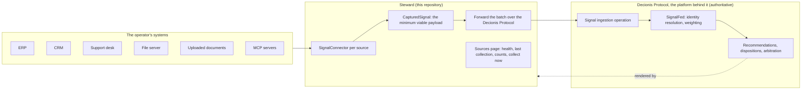

# Signal connectors: Steward collects the context

**Status: decided 24 September 2026, implementation begun.** This is a trust-boundary change and
is recorded as one. Steward collects signals from the operator's own systems and forwards them upstream, over the Decionis Protocol, as context for the decisioning engine. What it does with them stops there: no weighting, no
policy, no decision, no execution, no record of authority. Those stay upstream.

## The decision

Businesses hold the evidence about their customers in systems they already run: an ERP, a CRM, a
support desk, a ledger, a file server, documents people upload, and, increasingly, MCP servers that
expose those systems to agents. The decisioning engine can only weigh what reaches it. Steward is
the tier that sits beside those systems, in the operator's trust domain, so Steward is where the
signals are collected and shaped into the minimum viable payload the engine needs, and the engine
is where they are weighed at the moment of decision.

What moves into this repository:

- **Connectors** to signal sources, with their health and their last collection visible to the
  operator.
- **Connector credentials at run time**, supplied as mounted secrets or environment, never in the
  repository, never to the browser, never logged.
- **Outbound requests to configured signal sources**, in addition to the platform.
- **Document intake**: an uploaded PDF or Word document is parsed to text and to signals, in
  memory, and forwarded; nothing is stored.

What stays in the platform, unchanged:

- Identity resolution: a signal names an account as the source knows it; the platform resolves it.
- Weighting, classification into recommendations, policy evaluation, arbitration.
- Execution grants, Decision Dossiers, the audit ledger.
- Tenant identity and roles.

The two commitments that survive intact: nothing is persisted in this tier, and there is no
telemetry. A collected signal is in memory until it is forwarded, and the only hosts this tier
talks to are the platform and the sources an operator configured.

## The flow

The loop closes where it always did: recommendations come back down to the queue, an approver
reviews, the platform executes and records. What is new is the first arrow.

## The payload

A connector produces `CapturedSignal`s, and a collection is a `SignalBatch`. The shape is the
minimum the engine needs to weigh a signal and nothing that would make Steward a store:

| Field              | What it is                                                                                       |
| ------------------ | ------------------------------------------------------------------------------------------------ |
| `id`               | Stable within the source, so a re-collection does not duplicate                                  |
| `sourceId`         | The connector that captured it                                                                   |
| `sourceRecordId`   | The record in the source system, for provenance on the evidence panel                            |
| `accountReference` | The account as the source knows it; the platform resolves identity                               |
| `observedAt`       | When the source says it happened; `capturedAt` is when Steward collected it                      |
| `category`         | `USAGE`, `SUPPORT`, `CRM`, `TRANSACTION`, `KYC_KYB`, `DOCUMENT`: where it came from              |
| `contextClass`     | Optional; a connector may know it (a support ticket is `FRICTION`), else the platform assigns it |
| `title`, `detail`  | What a person reads on the evidence panel                                                        |
| `confidence`       | The connector's confidence in the extraction, 0 to 1                                             |

The `DOCUMENT` category is new, for signals extracted from an uploaded or fetched file, and the
evidence panel shows it like any other.

## Security model

- **Credentials**: one environment variable or mounted file per connector, named in the source's
  configuration, read once at start, never echoed, never serialised into a page, never in a URL.
  The threat model gains them as an asset in this tier.
- **Egress allowlist**: a connector may only reach the host its configuration names; a source URL
  supplied at run time is refused unless it matches. This is the SSRF control, and it is a test.
- **Documents**: parsed in memory with a size limit and a page limit, by a parser that does not
  execute embedded content; the bytes are discarded after the signals are produced. Upload is
  role-gated to `OPERATOR` and above.
- **MCP**: Steward is an MCP client only; it calls tools and reads resources on servers an
  operator configured, and exposes no MCP server of its own.
- **Forwarding**: a batch carries an idempotency key; the platform accepts, rejects per signal with
  a reason, and Steward shows both. A batch that cannot be forwarded is reported, not stored.
- **Browser**: nothing changes. The browser talks to this application's BFF only.

## The connector catalogue

| Source                           | Kind          | How Steward reaches it                                                 | Dependency, license                                      | Workstream |
| -------------------------------- | ------------- | ---------------------------------------------------------------------- | -------------------------------------------------------- | ---------- |
| Uploaded document                | `FILE_UPLOAD` | Multipart upload to the BFF; PDF and Word parsed to text               | PDF and DOCX parsers, both to pass `pnpm licenses:check` | S2         |
| MCP server                       | `MCP`         | MCP client over stdio or streamable HTTP; tools and resources          | `@modelcontextprotocol/sdk` (MIT)                        | S3         |
| CRM                              | `CRM`         | REST adapter per vendor, first a generic JSON adapter                  | none                                                     | S4         |
| ERP                              | `ERP`         | REST/OData adapter per vendor, first a generic JSON adapter            | none                                                     | S4         |
| File server                      | `FILE_SERVER` | S3-compatible object store first; SFTP second                          | S3 client (Apache-2.0); SFTP client to be checked        | S5         |
| Support desk, usage, ledger, KYC | as today      | Remain platform-side connectors until an operator asks for a local one |                                                          | later      |

## Workstreams

#### S1 — The connector framework and the Sources page (no new dependency) ✅ Done (#90)

- `domain/signals/`: `SignalSource`, `CapturedSignal`, `SignalBatch`, `SignalForwardResult`.
- `infra/connectors/`: the `SignalConnector` interface, `SignalConnectorRegistry` built from
  configuration, `DemoSignalConnector` for demo mode.
- `application/signals/SignalService`: list sources, collect from one, forward a batch; collection
  and forwarding gated to `OPERATOR`, `APPROVER`, `ADMIN`.
- `infra/repositories`: `SignalRepository` with demo and live implementations; live is a Decionis
  Protocol client for the ingestion operation below.
- BFF: `GET /api/steward/signals/sources`, `POST /api/steward/signals/sources/:id/collect`.
- `/signals`: the Sources page, with health, last collection, counts, categories, and "Collect
  now"; the sidebar links it.
- The boundary documents updated in the same pull request, so the tree and the claims agree.

#### S2 — Document intake

Upload a PDF or Word document; extract text; produce `DOCUMENT` signals with the account
reference the operator supplies or the document names; forward. Size and page limits; the bytes
discarded. Dependencies added under the license policy.

#### S3 — MCP connector

Configure an MCP server by URL or command; list its tools and resources on the Sources page; map a
tool result or a resource to signals with a small declarative mapping; collect on demand and on a
schedule. Steward remains a client.

#### S4 — CRM and ERP adapters

A generic JSON adapter (an endpoint, a field mapping, a credential) first, then vendor adapters as
operators name them. Egress allowlisted per adapter.

#### S5 — File server

S3-compatible buckets first: list, fetch, parse with S2's extractor, forward. SFTP when asked.

#### S6 — Scheduled collection and back-pressure

A schedule per source, a cap per batch, and the forwarding result visible per run.

## Protocol request

Upstream means the Decionis Protocol: the published wire contract Steward already speaks for the
four `/v1/cdi` operations. Signal ingestion is one more operation in it. Proposed in the same
family as `POST /v1/cdi/signals`, accepting a `SignalBatch` with an idempotency key, resolving
`accountReference` to an account, and returning per-signal accepted or rejected with a reason; the
Protocol's authors decide the final path, shape and version, and Steward's client follows the
published contract, parsed through a Zod schema in `domain/` like every other operation. Until the
operation exists, S1 forwards in demo mode only, and live mode reports the operation as unavailable
rather than pretending. The `DOCUMENT` category and the connector kinds above are part of the same
request.

## Sequencing

| Stage          | Work   | Gate                                                                              |
| -------------- | ------ | --------------------------------------------------------------------------------- |
| **1. Frame**   | S1     | `pnpm verify`; the boundary documents changed in the same PR (#90)                |
| **2. Ask**     |        | The ingestion operation requested of the Protocol; its version and shape answered |
| **3. Intake**  | S2, S3 | Dependencies under the license policy; the egress and size tests green            |
| **4. Systems** | S4, S5 | Per adapter, with an operator's real source behind a feature branch               |
| **5. Cadence** | S6     | After at least one live source has run by hand                                    |

## Decisions recorded

| Question                                               | Decision                                                                                 |
| ------------------------------------------------------ | ---------------------------------------------------------------------------------------- |
| Who observes and collects signals?                     | Steward, through connectors in the operator's trust domain                               |
| Who resolves identity, weighs, decides, executes?      | The platform, reached over the Decionis Protocol, unchanged                              |
| Does Steward persist anything?                         | No. Collected signals are in memory until forwarded; documents are discarded             |
| Where do connector credentials live?                   | Mounted secrets or environment on the Steward server; never in the repository or browser |
| Does the value-tier vocabulary belong to the platform? | Yes                                                                                      |
| Is a proactive play an opportunity?                    | Yes, a new kind with a target group                                                      |
